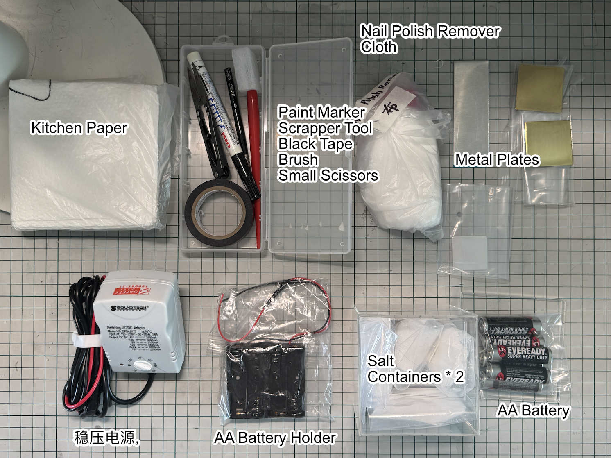
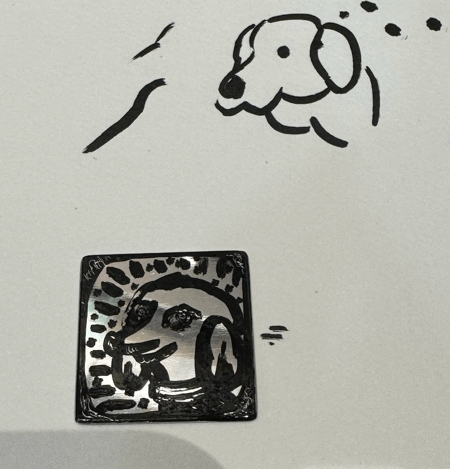
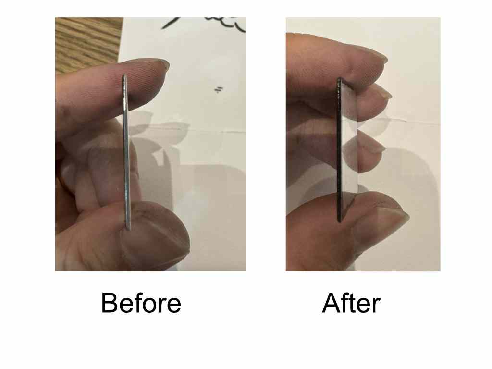
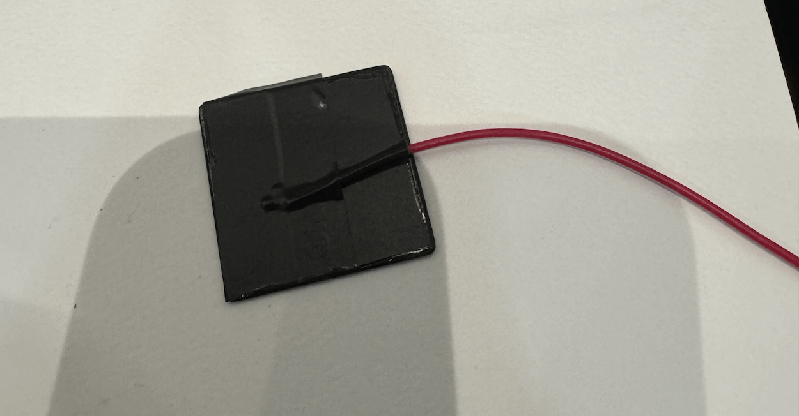
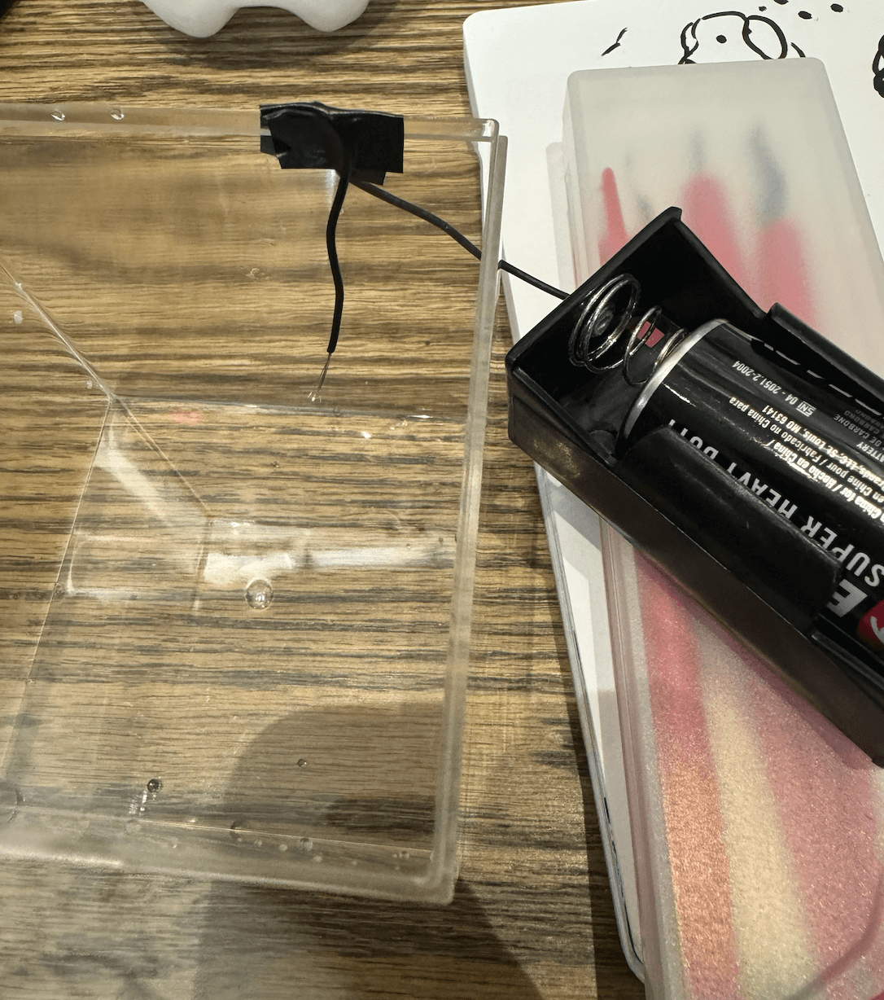
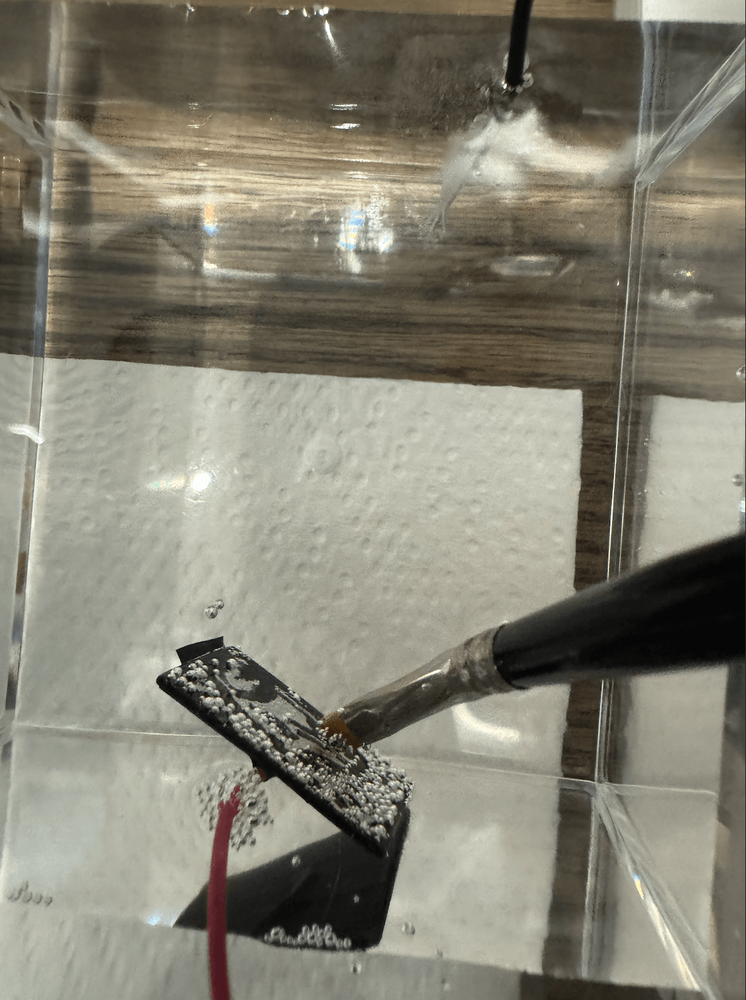

# Electro Etching

## Introduction

A technique using a standard battery or household power source combined with salt water to etch patterns or images on metal surfaces.

一种利用普通电池或家用电源以及盐水在金属表面蚀刻图案或图像的技术。

---

## Tool Kit Checklist

1. **Paint Marker 油漆笔** (inside pencil case)  
   **油漆笔**（铅笔盒内）

2. **Plates 金属板**

    - 2 pcs copper
    - 2 pcs small aluminum plates
    - 1 pc larger aluminum plate  
      **金属板**：2 片铜板，2 片小铝板，1 片大铝板

3. **Scraper Tool 挂刻工具** (red handle, inside pencil case)  
   **挂刻工具**（红色手柄，铅笔盒内）

4. **Salt 盐**

    - 75g \* 2 for one use in a large container
    - 40g \* 2 for two uses in smaller containers  
      **盐**：75 克 ×2（适用于大容器一次使用）；40 克 ×2（适用于小容器两次使用）

5. **Plastic Containers 塑料盒子**

    - One large container for water mixed with 150g salt
    - One smaller container for water mixed with 40g salt  
      **塑料盒子**：一个大盒子加 150 克盐水，一个小盒子加 40 克盐水

6. **AA Batteries × 6**  
   **AA 电池 ×6**

7. **Battery Container with Red and Black Cables 电池盒**

    - Red cable connects to the metal plate directly
    - Black cable touches the salt water  
      **电池盒**：红线接金属板，黑线接触盐水

8. **Black Tape 电胶带** (inside pencil case)

    - Used to secure the positive copper wire to the metal plate  
      **电胶带**（铅笔盒内）：固定阳极铜线到金属板上

9. **Brush 毛笔** (inside pencil case)

    - For removing bubbles on the plate surface  
      **毛笔**（铅笔盒内）：用于清除金属板表面的气泡

10. **Nail Polish Remover 洗甲水**

    - Used to remove paint marker traces on the metal plate
    - Slightly toxic, use in well-ventilated areas
    - Highly flammable, handle with care  
      **洗甲水**：用于去除金属板上的油漆笔痕迹，稍有毒，注意通风，易燃，使用小心

11. **Toilet Paper 吸水餐巾纸**

    - For wiping off salt water and cleaning  
      **吸水餐巾纸**：用于擦拭盐水和清洁

12. **Cloth 碎布**

    - White cloth for use with nail polish remover; dispose of in sealed plastic bags  
      **碎布**：白色布配合洗甲水使用，用后放入塑料袋密封丢弃

13. **Gloves 手套**
    - Purple gloves for basic protection against electricity and paint  
      **手套**：紫色手套，防止触电及油漆弄脏手

---

## Operation Process

1. **Draw Image on the Plate**  
   Use the paint marker1 to draw a pattern on one side of the plate2. Exposed areas will be etched, while black areas will remain shiny.  
   **在金属板上绘图**：用油漆笔1在金属板2的一面绘制图案。裸露区域将被蚀刻，黑色区域将保持光亮。  
   

2. **Scrape Details**  
   Use the scraper tool3 to remove unwanted paint. It works like an eraser and allows for fine details.  
   **雕刻细节**：使用刮刻工具3去除多余的油漆，就像橡皮擦一样，可创造精细的线条。

3. **Protect Edges**  
   Touch up the edges with paint marker to ensure areas not meant to be etched are protected.  
   **保护边缘**：用油漆笔修整边缘，确保不需要蚀刻的区域受到保护。  
   

4. **Prepare Salt Water**  
   Mix water with salt (40g salt for a small container, 150g for a large one). Reuse salt water after filtering dirt.  
   **准备盐水**：用水混合盐（小容器加 40 克盐，大容器 150 克）。过滤杂质后可重复使用。

5. **Connect the Plate to the Battery**  
   Attach the red cable (positive) from the battery container7 to the **_back side_** of the metal plate2. Secure the connection with black tape8. Ensure no part of the metal plate that connects to the red cable is exposed to the salt water.  
   **将金属板连接到电池上**  
   将电池盒7的红线（正极）连接到金属板2的**_背面_**，用电胶带8固定连接。确保背面金属板部分不会接触盐水。  
   

6. **Connect the Black Cable to the Container**  
   Fix the black cable (negative) from the battery container7 to the salt water container. Ensure the copper wire is submerged at least 1–2 cm into the water.  
   **将黑线连接到容器上**  
   将电池盒7的黑线（负极）固定到盐水容器上，确保铜线至少浸入水中 1 至 2 厘米。
   

7. **Insert Batteries and Ensure Safety**  
   Insert the AA batteries6 into the battery container. **_Important_**: Ensure the red and black cables do not touch each other to avoid a short circuit.  
   **插入电池并确保安全**  
   将 AA 电池6放入电池盒中。**_注意_**：确保红线和黑线不要相互接触，以避免短路。

8. **Start Etching**  
   Slowly immerse the metal plate into the salt water, ensuring the image side faces the negative cable. When bubbles appear, the etching process has started. For deep etching, it takes about 10 minutes with 4 AA batteries, and 4–5 minutes for light etching. Use a brush9 to remove bubbles if they accumulate on the plate. Keep the plate vertical for optimal results.  
   **开始蚀刻**  
   慢慢将金属板插入盐水中，确保图案面朝向负极线。当出现气泡时，表示蚀刻过程已经开始。使用 4 节 AA 电池时，深蚀刻需要大约 10 分钟，浅蚀刻需要 4 至 5 分钟。如果气泡堆积在板上，使用毛笔9清除气泡。保持金属板垂直以获得最佳效果。  
   

9. **Check the Etching Progress**  
   Remove the metal plate to inspect progress. When the shiny surface is gone and replaced with a rough, dull texture, the etching is complete. You can continue etching for a deeper image if needed. **_Hint_**: Salt water is difficult to clean. Use kitchen paper11 to dry the plate before checking. It is normal for the water to become muddy or change color as long as bubbling continues.  
   **检查蚀刻进度**  
   取出金属板检查进度。当光亮表面消失并变为粗糙、暗哑的质感时，蚀刻完成。如果需要，可以继续蚀刻以获得更深的图案。**_提示_**：盐水难以清洗，检查前用吸水纸巾11擦干板子。只要气泡持续，水变浑浊或变色是正常现象。

10. **Clean the Metal Plate**  
    Once etching is complete, remove the metal plate, rinse off the salt water, and use the provided cloth12 and nail polish remover10 to clean off the black paint. Wear gloves13 to avoid staining your hands.  
    **清理金属板**  
    蚀刻完成后，取出金属板，冲洗掉盐水，并使用碎布12和洗甲水10清除黑色油漆。戴上手套13，避免弄脏手。

11. **Dispose of Used Cloth Properly**  
    Place the used cloth in a sealed plastic bag before disposal. If you plan to reuse it, store it in a well-ventilated area as it may emit a strong and toxic smell.  
    **妥善处理用过的碎布**  
    将用过的碎布放入密封塑料袋中再丢弃。如果打算重复使用，请将其存放在通风良好的地方，因为可能散发强烈的气味, 并且易燃.

12. **Store or Reuse Salt Water**  
    Salt water can be reused for the next etching session. Pour it into a plastic bottle for storage, keeping only the clear water. Discard any mud or impurities.  
    **保存或重复使用盐水**  
    盐水可用于下次蚀刻。将其倒入塑料瓶中保存，只保留清水，丢弃泥渣或杂质。
